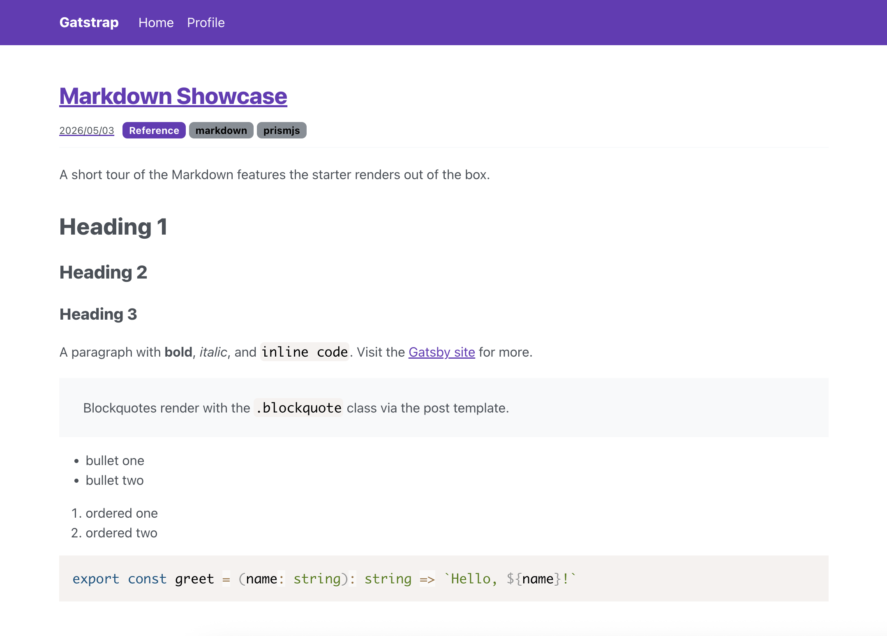

# Gatstrap

A **Bootstrap 5** starter for Gatsby — fast, accessible, and ready to fork.

[](https://app.netlify.com/sites/gatstrap/deploys)
[](https://github.com/jaxx2104/gatsby-starter-bootstrap/actions/workflows/ci.yml)



## Features

- **Gatsby 5.16+** with React 19 and TypeScript (strict).
- **Bootstrap 5.3** via Sass — no jQuery, no popper.
- Markdown blog with Prism syntax highlighting.
- `gatsby-plugin-image` for responsive images.
- Gatsby `<Head>` API for per-page SEO.
- Lighthouse mobile **95+** on Performance, Accessibility, Best Practices, SEO.

## Quick start

```bash
gatsby new my-blog https://github.com/jaxx2104/gatsby-starter-bootstrap
cd my-blog
yarn develop
```

Open <http://localhost:8000>.

## Configuration

Edit `gatsby-config.ts`. The `siteMetadata` block is the single source of truth
for the navbar title, the per-page SEO `<Head>`, and the PWA manifest:

```ts
const siteMetadata = {
  title: 'Your Site',
  description: 'Your description.',
  siteUrl: 'https://example.com',
  author: 'Your Name',
  twitter: 'your_handle',
}
```

## Customization

Theme tokens are at `src/scss/colors.scss` and `src/scss/fonts.scss`. Override
Bootstrap 5 Sass variables there before the `bootstrap` import in
`src/scss/gatstrap.scss`.

To swap the brand color:

```scss
// src/scss/colors.scss
$purple: #00bcd4;
```

## Writing posts

Add a folder under `content/posts/`:

```
content/posts/2026-06-01-my-post/
  index.md
  hero.jpg
```

`index.md` frontmatter:

```yaml
---
layout: post
title: My Post
path: /my-post
category: Notes
tags: [example]
description: A one-sentence description.
date: 2026-06-01
---
```

## Scripts

| Command          | Description                                |
| ---------------- | ------------------------------------------ |
| `yarn develop`   | Start the dev server                       |
| `yarn build`     | Production build to `public/`              |
| `yarn typecheck` | Run TypeScript strict mode checks          |
| `yarn lint`      | Run Biome lint                             |
| `yarn lint:fix`  | Run Biome check (lint + format) with fixes |
| `yarn format`    | Run Biome format                           |

## Contributing

1. Fork and clone.
2. `yarn` to install (Node 20).
3. `yarn typecheck`, `yarn lint`, and `yarn build` must pass before opening a
   pull request.
4. Pre-commit hooks run `lint-staged` automatically.
5. `git push` runs `yarn typecheck` via a `pre-push` hook. Use
   `git push --no-verify` to skip during work-in-progress pushes.
6. SCSS and Markdown files are not formatted by tooling — follow the
   `.editorconfig` settings (2-space indent, LF line endings, UTF-8).

## License

Released under the [0BSD License](./LICENSE).
