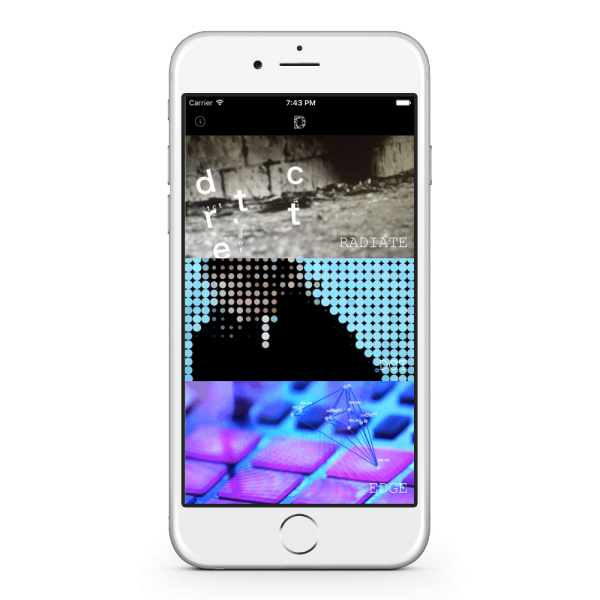
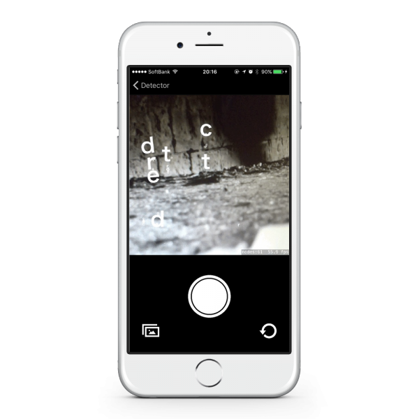
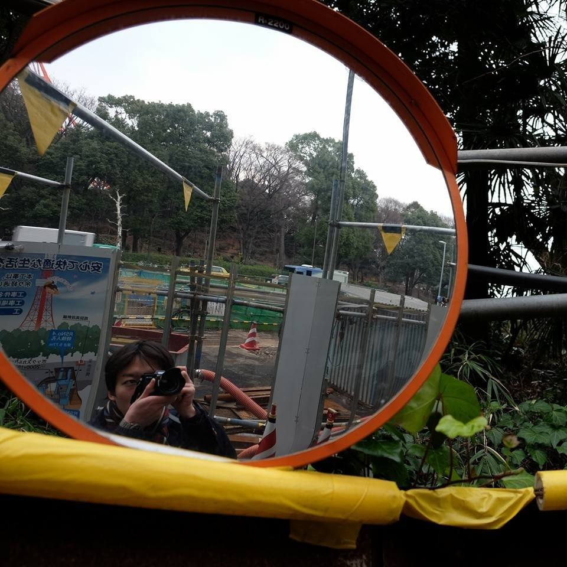

<section class="jumboimage" style="background-image: url('bg.jpg')">
  

    <h1 class="display-1">Detector</h1>
  

</section>

<section class="" id="about">
  

    

      

        
Detector is a camera app with live filter.
         Let&#8217;s go on a creative travel of detection, to have your new eyes.
         Filter has prepared three types . Or react to color and movement, graphics will change by tapping the screen.
         We created the students and the Detector that to have a two-way installation of the photographer and the subject on the concept.
        

      

      

        
      

    

  

</section>
<section class="bg-danger text-xs-center" id="concept">
  

    

      

        <h2 class="section-heading">Detail </h2>
        

      

    

  

  

    

      

        
      

      

        
      

      

    

    

  

</section>
<section id="features">
  

    

      

        <h2 class="section-heading">Features </h2>
        

      

      

    

    

  

  

    

      

        

          <i class="fa fa-2x fa-camera wow bounceIn text-danger" style="visibility: visible; animation: bounceIn; -webkit-animation: bounceIn;"></i>
          <h5>Live Fillter Camera </h5>
          
リアルタイムでエフェクトがかかるカメラアプリです。

        

      

      

        

          <i class="fa fa-2x fa-eye wow bounceIn text-danger" data-wow-delay=".1s" style="visibility: visible; animation: bounceIn 0.1s; -webkit-animation: bounceIn 0.1s;"></i>
          <h5>Detect Engine </h5>
          
画像解析にはOpenCVを使用しています。

        

      

      

        

          <i class="fa fa-2x fa-bolt wow bounceIn text-danger" data-wow-delay=".2s" style="visibility: visible; animation: bounceIn 0.2s; -webkit-animation: bounceIn 0.2s;"></i>
          

          <h5>Good Typesetting </h5>
          
色や動きに反応したり、画面をタップすることでグラフィックが変化します。
          

          

        

        

      

      

        

          <i class="fa fa-2x fa-users wow bounceIn text-danger" data-wow-delay=".3s" style="visibility: visible; animation: bounceIn 0.3s; -webkit-animation: bounceIn 0.3s;"></i>
          

          <h5>Team Developed </h5>
          
学生の人たちとの共同制作です。
          

          

        

        

      

      

    

    

  

</section>
<section class="bg-dark" id="member">
  

    

      

        <h2 class="section-heading">Member </h2>
        

      

      

    

    

  

  

    

      

      

        
        
Futoshi Iwashita

      

      

        
        
Eriko Shimada

      

      

        
        
Shun Irie

      

      

        
        
Akito Suzuki

      

      

        
        
Ayaka Tarui

      

    

  

</section>
