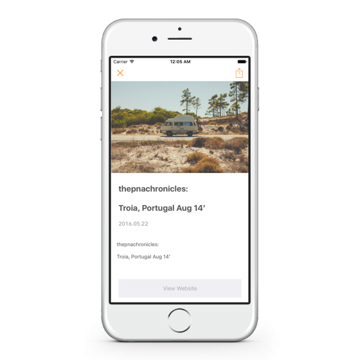

<section class="jumboimage" style="background-image: url('bg.jpg')">
    <h1 class="display-1">Yomu</h1>
</section>

<section class="" id="about">
  

    

      

        
Yomu is the RSS reader born to the concept &#8220;which looks through all the reports single hand&#8221; in Japan.
         In the list screen which carried out the form of the palette, a site can be crossed and a report can be read.
         Please register a favorite site and blog and create only your leader.
        

      

      

        
      

    

  

</section>

<section class="bg-danger text-xs-center" id="concept">
  

    

      

        <h2 class="section-heading">Detail </h2>
        

      

    

  

  

    

      

        
      

      

        
      

    

  

</section>
<section id="features">
  

    

      

        <h2 class="section-heading">Features </h2>
        

      

    

  

  

    

      

        

          <i class="fa fa-2x fa-th-large wow bounceIn text-danger" style="visibility: visible; animation: bounceIn; -webkit-animation: bounceIn;"></i>
          <h5>Grid Layout</h5>
          
格子状の一覧画面ではサイトを横断して記事を読むことが出来ます。

        

      

      

        

          <i class="fa fa-2x fa-hand-paper-o wow bounceIn text-danger" data-wow-delay=".1s" style="visibility: visible; animation: bounceIn 0.1s; -webkit-animation: bounceIn 0.1s;"></i>
          <h5>Simple UI </h5>
          
大画面でも片手で操作出来るように設計しました。上下のスワイプで記事を「読む」「閉じる」の動作が出来ます。

        

      

      

        

          <i class="fa fa-2x fa-newspaper-o wow bounceIn text-danger" data-wow-delay=".2s" style="visibility: visible; animation: bounceIn 0.2s; -webkit-animation: bounceIn 0.2s;"></i>
          <h5>Good Typesetting </h5>
          
サイトごとの余計な改行やスタイルをアプリが置換し読みやすい文字組みで表示します。

        

      

      

        

          <i class="fa fa-2x fa-heart wow bounceIn text-danger" data-wow-delay=".3s" style="visibility: visible; animation: bounceIn 0.3s; -webkit-animation: bounceIn 0.3s;"></i>
          <h5>Made with Love </h5>
          
アプリの要望に応えるべくアップデートしていきます。

        

      

    

  

</section>
